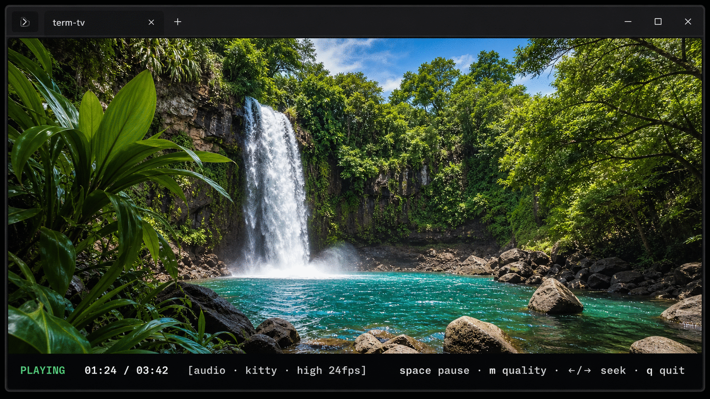

# term-tv

Watch local videos, HLS streams, and free Internet TV directly in a terminal.
FFmpeg handles decoding while `term-tv` renders either true-color Unicode
blocks or native Kitty graphics.



> The screenshot demonstrates Kitty native-graphics mode. Text mode works in
> other true-color terminals but is limited by the terminal's character grid.

## Features

- Plays MP4, MKV, WebM, MOV, AVI, MPEG, and other FFmpeg-supported formats
- Plays direct HTTP/HTTPS video and HLS (`.m3u8`) streams
- Includes a built-in free Internet TV channel guide
- Loads local or remote M3U playlists
- Provides synchronized audio through `ffplay`
- Supports pause, seek, terminal resize, and live quality switching
- Offers portable true-color text rendering
- Uses native pixel graphics automatically inside Kitty
- Has no Python package dependencies

## Requirements

- Linux or macOS
- Python 3.10 or newer
- FFmpeg tools: `ffmpeg`, `ffprobe`, and `ffplay`
- An interactive terminal with 24-bit color support
- Git, for the installation steps below

Kitty is optional, but recommended for the sharpest image.

## Installation walkthrough

### 1. Install FFmpeg and Git

Ubuntu or Debian:

```bash
sudo apt update
sudo apt install ffmpeg git
```

Fedora:

```bash
sudo dnf install ffmpeg git
```

Arch Linux:

```bash
sudo pacman -S ffmpeg git
```

macOS with Homebrew:

```bash
brew install ffmpeg git
```

Verify that the required programs are available:

```bash
python3 --version
ffmpeg -version
ffplay -version
git --version
```

### 2. Clone term-tv

```bash
git clone https://github.com/sinXne0/term-tv.git
cd term-tv
```

### 3. Run the installer

```bash
./install.sh
```

The installer:

- creates `~/.local/bin` when needed;
- installs the `term-tv` command as a symbolic link;
- installs `tvp` as a compatibility alias;
- adds `~/.local/bin` to `~/.bashrc` if it is not already on `PATH`.

Reload Bash after installation:

```bash
source ~/.bashrc
```

If you use another shell, add this line to that shell's profile:

```bash
export PATH="$HOME/.local/bin:$PATH"
```

For example, Zsh users can add it to `~/.zshrc`.

### 4. Confirm the installation

```bash
term-tv --help
```

### 5. Play your first video

```bash
term-tv ~/Videos/movie.mp4
```

Quote paths containing spaces:

```bash
term-tv "$HOME/Videos/movie night.mp4"
```

Run the command without a path to choose a local video or open Internet TV:

```bash
term-tv
```

## Getting the best image quality

### Kitty native graphics — recommended

Text characters cannot reproduce the full resolution of a video. Kitty mode
displays real pixels and is the recommended option for a sharp image.

On Ubuntu or Debian, install Kitty if it is not already available:

```bash
sudo apt install kitty
```

Open Kitty, then run:

```bash
term-tv --renderer kitty --quality high ~/Videos/movie.mp4
```

When `--renderer auto` is used, `term-tv` detects Kitty and selects native
graphics automatically.

### Portable text mode

Use text mode in terminals without Kitty graphics support:

```bash
term-tv --renderer text --quality balanced ~/Videos/movie.mp4
```

Text-mode resolution depends on terminal columns and rows. For a clearer image:

- maximize the terminal window;
- reduce the terminal font size;
- use `--quality high`;
- avoid terminal multiplexers while troubleshooting.

## Common commands

Play a local file:

```bash
term-tv ~/Videos/movie.mp4
```

Play silently:

```bash
term-tv --no-audio ~/Videos/movie.mp4
```

Use the fast preset on slower hardware or remote terminals:

```bash
term-tv --quality fast ~/Videos/movie.mp4
```

Use maximum quality:

```bash
term-tv --quality high ~/Videos/movie.mp4
```

Open the built-in Internet TV guide:

```bash
term-tv --tv
```

Play a direct HTTP or HLS stream:

```bash
term-tv "https://example.org/live/channel.m3u8"
```

Open a local M3U playlist:

```bash
term-tv --playlist ~/Downloads/channels.m3u
```

Open a remote M3U playlist:

```bash
term-tv --playlist "https://example.org/channels.m3u"
```

Only play streams and playlists that you are authorized to access. Broadcasters
may change or expire stream URLs independently of `term-tv`.

## Controls

| Key | Action |
| --- | --- |
| `Space` | Pause or resume |
| `Left arrow` | Seek backward 5 seconds |
| `Right arrow` | Seek forward 5 seconds |
| `m` | Cycle through fast, balanced, and high quality |
| `q` | Quit |

Seeking is disabled for live streams that do not report a duration.

## Quality presets

| Preset | Target frame rate | Intended use |
| --- | ---: | --- |
| `fast` | 10 fps | Slow terminals, SSH, and low CPU usage |
| `balanced` | 15 fps | Default text-mode playback |
| `high` | Up to 24 fps | Best scaling, color detail, and Kitty playback |

The high preset uses Lanczos scaling, full-chroma interpolation, sharpening,
and RGB-aware quadrant reconstruction in text mode.

## Troubleshooting

### Audio plays but the picture is frozen

Stop the player, then test the portable path:

```bash
term-tv --renderer text --quality fast --no-audio ~/Videos/movie.mp4
```

Run directly in the terminal rather than through `tmux` or `screen`. If text
mode works and Kitty mode does not, confirm that the command is running inside
Kitty:

```bash
printf '%s\n' "$TERM"
```

Kitty normally reports `xterm-kitty`.

### The image is blurry

Use Kitty native graphics:

```bash
term-tv --renderer kitty --quality high ~/Videos/movie.mp4
```

In text mode, blur is expected when the terminal has a small character grid.
Increasing the source video's resolution cannot overcome that grid limit.

### `term-tv: command not found`

Reload the shell:

```bash
source ~/.bashrc
```

Then verify the installation path:

```bash
ls -l ~/.local/bin/term-tv
printf '%s\n' "$PATH"
```

### FFmpeg is missing

Confirm all three programs are installed:

```bash
command -v ffmpeg
command -v ffprobe
command -v ffplay
```

## Updating

From the cloned repository:

```bash
cd term-tv
git pull --ff-only
./install.sh
```

Because the installed command is a symbolic link, most source updates take
effect immediately. Running the installer again also refreshes the links.

## Uninstalling

Remove the installed commands:

```bash
rm ~/.local/bin/term-tv ~/.local/bin/tvp
```

Then remove the cloned repository if it is no longer needed.

## Development

Run the tests:

```bash
python3 -m unittest -v
```

Check syntax:

```bash
python3 -m py_compile term_tv.py test_term_tv.py
bash -n install.sh
```

The same unit tests run on Python 3.10 and 3.13 through GitHub Actions.

## License

`term-tv` is available under the [MIT License](LICENSE).
